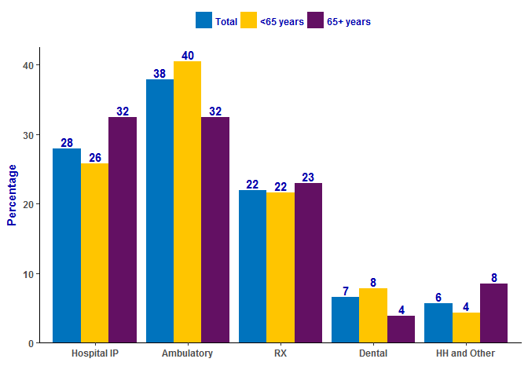

Analyzing MEPS data using R
================
Emily Mitchell and James Durant
<br>
February 2, 2017

-   [Loading MEPS Data](#loading-meps-data)
    -   [Option 1. Download SAS transport file to computer](#option-1.-download-sas-transport-file-to-computer)
    -   [Option 2. Load data directly from website](#option-2.-load-data-directly-from-website)
-   [Survey Package](#survey-package)
    -   [Install and load **survey** package](#install-and-load-survey-package)
    -   [Define survey design object](#define-survey-design-object)
-   [Expenses per person, by source of payment](#expenses-per-person-by-source-of-payment)
    -   [Total population](#total-population)
    -   [Total expenses](#total-expenses)
    -   [Percent with expense](#percent-with-expense)
    -   [Mean and median, per person with an expense](#mean-and-median-per-person-with-an-expense)
    -   [Distribution of expenses by source of payment](#distribution-of-expenses-by-source-of-payment)
-   [Percent distribution by type of service](#percent-distribution-by-type-of-service)
    -   [Export table to Excel (csv file)](#export-table-to-excel-csv-file)
    -   [Create a barplot in R](#create-a-barplot-in-r)
-   [Saving your data](#saving-your-data)
-   [Bonus Material](#bonus-material)
    -   [svyby](#svyby)
    -   [ggplot2](#ggplot2)


Objectives
================
* Understand how to install and load packages into R
* Load MEPS data into a data frame
* Create a `survey` object from MEPS data frame
* Create summary tables
* Create summary graphics


Loading Packages
=================

To load MEPS data, we will use the foreign package, which allows R to read SAS transport files. The `install.packages` function only needs to be run once (to download the package from the internet and store it on your computer). Typically, this is done with the command `install.packages("foreign")`. The `library` function needs to be run every time you re-start your R session.


<div class="panel panel-info">
  <div class="panel-heading">
  <h3 class="panel-title">Installing and Loading Packages</h3>
  </div>
  <div class="panel-body">
  <p>Packages are sets of R functions that are downloaded and installed into the R system. A library only needs to be installed once per R installation. However, the `library` function needs to be run every time you re-start your R session to load the package. Packages are tailor made to help perform certain statistical, graphical, or data tasks. Since R is used by many analysts, it is typical for only some packages to be loaded for each analysis.</p>
  </div>
</div>


``` r
 install.packages("foreign")  # Only need to run these once
 install.packages("survey")
 
 library(foreign) # Run these every time you re-start R
 library(survey)
```

Loading MEPS data
=================

We will need to load the data from the MEPS website into R. The data will be stored in a *data.frame* called `FYC2013`, since we are retrieving the 'Full Year Consolidated' file for the year 2013.


Loading from a local directory
----------------------------

If you have manually downloaded and unzipped the MEPS data file to a local directory, you should save it to your local system. Here's an example where the files are stored at "C:\\MEPS\\SASDATA\\h163.ssp" on a Windows system:


<br>
The following code will load the data, using the foreign package function `read.xport`:

``` r
FYC2013 = read.xport("C:/MEPS/SASDATA/h163.ssp")
```
The object **FYC2013** is now loaded into R's memory as a data frame. 

<div class="alert alert-warning">
  <h4>Warning!</h4>
  <p>Be aware the directory names need to be separated by a slash ("/") or a double backslash ("\\\\"). This is because the single backslash is almost universally used as an string escape character in computing</p>
</div>
<br>

Load data directly from the MEPS website
----------------------------------------
Preferably, data downloading tasks can be automated using R. This offers several advantages when:

1. a large number of files need to be downloaded and,
2. another researcher needs to verify which files were downloaded (and from where),
3. data files might be updated periodically.

To do this, use the `download.file` function to save the zip file from MEPS website to the temporary file `temp`. Then use the `unzip` and `read.xport` functions to unzip and load the SAS transport data into R as a data frame.

``` r
download.file("https://meps.ahrq.gov/mepsweb/data_files/pufs/h163ssp.zip",
              temp <- tempfile())
unzipped_file = unzip(temp)
FYC2013 = read.xport(unzipped_file)
unlink(temp) # Unlink to delete temporary file
```

<div class="panel panel-info">
  <div class="panel-heading">
  <h3 class="panel-title">Getting the stored file location</h3>
  </div>
  <div class="panel-body">
  <p>To get the file location for a specific dataset, right-click on the ZIP link, then select 'Copy link address' to copy the location to your the clipboard. </p>
  
  
  </div>
</div>


Using the **survey** package
============================

We'll demonstrate use of the following functions from the survey package:

*   `svytotal`: population totals
*   `svymean`: proportions and means
*   `svyquantile`: quantiles (e.g. median)
*   `svyratio`: ratio statistics (e.g. percentage of total expenditures)
*   `svyglm`: generalized linear regression
*   `svyby`: run other survey functions by group


Define survey design object
---------------------------
The `svydesign` function specifies the primary sampling unit, the strata, and the sampling weights for the data frame. The function also allows for nested designs.

``` r
mepsdsgn = svydesign(id = ~VARPSU, 
                     strata = ~VARSTR, 
                     weights = ~PERWT13F, 
                     data = FYC2013, 
                     nest=TRUE)  
```

Expenses per person, by source of payment
-----------------------------------------

This is a partial recreation of a [MEPS summary table for health expenditures in 2013](https://meps.ahrq.gov/mepsweb/data_stats/tables_compendia_hh_interactive.jsp?_SERVICE=MEPSSocket0&_PROGRAM=MEPSPGM.TC.SAS&File=HCFY2013&Table=HCFY2013_PLEXP_%40&VAR1=AGE&VAR2=SEX&VAR3=RACETH5C&VAR4=INSURCOV&VAR5=POVCAT13&VAR6=REGION&VAR7=HEALTH&VARO1=4+17+44+64&VARO2=1&VARO3=1&VARO4=1&VARO5=1&VARO6=1&VARO7=1&_Debug=):

### Total population

Total population = sum of survey weights (PERWT13F). We don't need to use a **svy** function here, since standard errors are not applicable to population control totals.
``` r
sum(FYC2013$PERWT13F) 
```
    ##  [1] 315721982

### Total expenses


To use the `svytotal` function, we can use the '$' notation to indicate that we want to use dataset FYC2013 and variable TOTEXP13.

``` r
svytotal(FYC2013$TOTEXP13, design = mepsdsgn)  
```

    ##           total         SE
    ## [1,] 1.4005e+12 4.3378e+10

Or we can use the formula notation '~', to tell R that we want to look in the design object `mepsdsgn` (in which we defined dataset FYC2013) to find the variable TOTEXP13.

``` r
svytotal(~TOTEXP13,design = mepsdsgn)  
```

    ##               total         SE
    ## TOTEXP13 1.4005e+12 4.3378e+10

### Percent with expense

To calculate the percent of people with any expense, first create a new indicator variable for persons with an expense.

``` r
FYC2013$any_expense = (FYC2013$TOTEXP13 > 0)*1
```

<br>
<div class="panel panel-danger">
  <div class="panel-heading">
  <h4 class="panel-title">Adding data after defining design produces an error!</h3>
  </div>
  <div class="panel-body">
   <p>If we try to run `svymean`, we will get an error, since we added a variable to the data set after defining the survey design object, `mepsdsgn`. </p>
  </div>
</div>

First, we need to re-run the code defining `mepsdsgn` to include the dataset with the new variable. Then we can run the `svymean` function, since the `mepsdsgn` object now includes the version of the dataset that contains the new variable `any\_expense`.

``` r
mepsdsgn = svydesign(id = ~VARPSU, 
                     strata = ~VARSTR, 
                     weights = ~PERWT13F, 
                     data = FYC2013, 
                     nest=TRUE)

svymean(~any_expense,design = mepsdsgn)                      
```
    ##                mean     SE
    ## any_expense 0.84398 0.0036

### Mean and median, per person with an expense

To get expenses per person with an expense, we want to limit the dataset to persons that have an expense (i.e. `any\_expense == 1`), using the `subset` function.

``` r
svymean(~TOTEXP13, design = subset(mepsdsgn,any_expense==1)) 
```

    ##          mean     SE
    ## TOTEXP13 5256 118.17

``` r
svyquantile(~TOTEXP13, design = subset(mepsdsgn,any_expense==1),quantiles = 0.5) 
```

    ##           0.5
    ## TOTEXP13 1389

### Distribution of expenses by source of payment

For percent of total, we need to use the `svyratio` function, and specify the numerator and denominator. First, we'll estimate the percent for out-of-pocket payments (`TOTSLF13`).

``` r
svyratio(~TOTSLF13, denominator = ~TOTEXP13, design = mepsdsgn)
```

    ## Ratio estimator: svyratio.survey.design2(~TOTSLF13, denominator = ~TOTEXP13, design = mepsdsgn)
    ## Ratios=
    ##           TOTEXP13
    ## TOTSLF13 0.1377617
    ## SEs=
    ##             TOTEXP13
    ## TOTSLF13 0.004395095

We can also calculate percentages for multiple variables at one time, using a '+' sign in the formula notation.

``` r
svyratio(~TOTSLF13 + TOTPTR13 + TOTMCR13 + TOTMCD13, 
    denominator = ~TOTEXP13, 
    design = mepsdsgn)
```

    ## Ratio estimator: svyratio.survey.design2(~TOTSLF13 + TOTPTR13 + TOTMCR13 + TOTMCD13, 
    ##     denominator = ~TOTEXP13, design = mepsdsgn)
    ## Ratios=
    ##           TOTEXP13
    ## TOTSLF13 0.1377617
    ## TOTPTR13 0.4060437
    ## TOTMCR13 0.2530722
    ## TOTMCD13 0.1243487
    ## SEs=
    ##             TOTEXP13
    ## TOTSLF13 0.004395095
    ## TOTPTR13 0.011466596
    ## TOTMCR13 0.009134258
    ## TOTMCD13 0.007487569

Before estimating percentages for 'Other' insurance, we need to adjust this variable to match the online table: Other = VA + worker's comp + other sources.

Previously, we did this by adding new variables to the dataset FYC2013, and then re-defining the design object `mepsdsgn`. But, we can streamline this process by using the `update` function to make changes to `mepsdsgn` directly, without changing the dataset FYC2013.

``` r
mepsdsgn <- update(mepsdsgn, tototh13 = TOTVA13 + TOTWCP13 + TOTOTH13)
svyratio(~tototh13, denominator = ~TOTEXP13, design = mepsdsgn)
```

    ## Ratio estimator: svyratio.survey.design2(~tototh13, denominator = ~TOTEXP13, design = mepsdsgn)
    ## Ratios=
    ##            TOTEXP13
    ## tototh13 0.07877691
    ## SEs=
    ##             TOTEXP13
    ## tototh13 0.005148356


Percent distribution by type of service
---------------------------------------

Now we will re-create the data table for Figure 1 in [Statistical brief \#491: "National Health Care Expenses in the U.S. Civilian Noninstitutionalized Population, Distributions by Type of Service and Source of Payment, 2013" by Marie Stagnitti](https://meps.ahrq.gov/data_files/publications/st491/stat491.shtml).

### Update Design
To get ambulatory (OB+OP) and home health/other expenditures, we need to add variables to the **mepsdsgn** object.

``` r
  mepsdsgn <- update(mepsdsgn, 
                     ambexp13 = OBVEXP13 + OPTEXP13 + ERTEXP13,
                     hhexp13  = HHAEXP13 + HHNEXP13 + VISEXP13 + OTHEXP13)
```

### svyratio
Up until now, we've been running survey functions to estimate means, totals, etc., but we've only been printing that information to the R console, rather than storing those estimates.

Here, we create the variable `pct\_TOS` to store the estimates from the `svyratio` function, which is calculating the percentage distribution of expenditures by type of service.

``` r
pct_TOS = svyratio(~IPTEXP13 + ambexp13 + RXEXP13 + DVTEXP13 + hhexp13, 
                     denominator = ~TOTEXP13, 
                     design = mepsdsgn)
```

Because we are storing estimates in the variable `pct\_TOS`, we have to ask R to specifically print the results if we want to view them.

``` r
print(pct_TOS)
```

    ## Ratio estimator: svyratio.survey.design2(~IPTEXP13 + ambexp13 + RXEXP13 + DVTEXP13 + 
    ##     hhexp13, denominator = ~TOTEXP13, design = mepsdsgn)
    ## Ratios=
    ##            TOTEXP13
    ## IPTEXP13 0.27911022
    ## ambexp13 0.37882294
    ## RXEXP13  0.21977145
    ## DVTEXP13 0.06556864
    ## hhexp13  0.05672677
    ## SEs=
    ##             TOTEXP13
    ## IPTEXP13 0.011717046
    ## ambexp13 0.008278700
    ## RXEXP13  0.007218369
    ## DVTEXP13 0.002462953
    ## hhexp13  0.003511954

Now we can do the same thing by age group (&lt; 65, and 65+), using the `subset` function.

``` r
pct_TOS_lt65 = svyratio(~IPTEXP13 + ambexp13 + RXEXP13 + DVTEXP13 + hhexp13, 
                        denominator = ~TOTEXP13, 
                        design = subset(mepsdsgn,AGELAST < 65))
  
pct_TOS_ge65 = svyratio(~IPTEXP13 + ambexp13 + RXEXP13 + DVTEXP13 + hhexp13, 
                        denominator = ~TOTEXP13, 
                        design = subset(mepsdsgn,AGELAST >= 65))
```

### Create output tables

Now we want to extract the coefficient estimates and combine them into a table. To do that, we can use the function `coef` to get the coefficients from the `svyratio` results, and then combine them into a matrix using `cbind`.

``` r
pct_matrix = cbind(coef(pct_TOS),
                   coef(pct_TOS_lt65),
                   coef(pct_TOS_ge65))*100
print(pct_matrix)
```

    ##                        [,1]      [,2]      [,3]
    ## IPTEXP13/TOTEXP13 27.911022 25.795551 32.383667
    ## ambexp13/TOTEXP13 37.882294 40.464733 32.422359
    ## RXEXP13/TOTEXP13  21.977145 21.540182 22.900994
    ## DVTEXP13/TOTEXP13  6.556864  7.848380  3.826269
    ## hhexp13/TOTEXP13   5.672677  4.351155  8.466711

To clean it up a bit, we can change the row and column names:

``` r
rownames(pct_matrix) <- c("Hospital IP",
                        "Ambulatory",
                        "RX",
                        "Dental",
                        "HH and Other")
 
colnames(pct_matrix) = c("Total","<65 years","65+ years")
  
print(pct_matrix)
```

    ##                  Total <65 years 65+ years
    ## Hospital IP  27.911022 25.795551 32.383667
    ## Ambulatory   37.882294 40.464733 32.422359
    ## RX           21.977145 21.540182 22.900994
    ## Dental        6.556864  7.848380  3.826269
    ## HH and Other  5.672677  4.351155  8.466711


### Output table to .csv file

If we are happy with our table, now we can export it to a .csv file, to further manipulate, create graphics, or share.

``` r
write.csv(pct_matrix,file = "C:/MEPS/figure1.csv")
```

### Graphics - Barplot Example

The default for the function `barplot` is to create a stacked bar plot if we give it a matrix, where each bar represents a column.

``` r
  barplot(pct_matrix) 
```


In order to switch the bar chart, so that the bars are type of service, not age group, we can use the transpose function `t` to pivot the matrix

``` r
print(t(pct_matrix))
```

    ##           Hospital IP Ambulatory       RX   Dental HH and Other
    ## Total        27.91102   37.88229 21.97714 6.556864     5.672677
    ## <65 years    25.79555   40.46473 21.54018 7.848380     4.351155
    ## 65+ years    32.38367   32.42236 22.90099 3.826269     8.466711

``` r
barplot(t(pct_matrix)) 
```


To change the bars to be side by side, use the `'beside = TRUE'` option

``` r
barplot(t(pct_matrix), beside = TRUE) 
```


We can also specify colors for the pars, add a label to the y-axis, add a legend, and add data labels on top of the bars.

``` r
bp <- barplot(t(pct_matrix),beside=TRUE,
                col = c("blue","yellow","magenta"),
                ylab = "Percentage",
                legend=T)

text(x = bp, y = t(pct_matrix)+2,
     labels = round(t(pct_matrix)),
     xpd=T,col="blue",font=2)
```


Saving your data
================

We've done all of this hard work to load in the MEPS files and calculate estimates, so how can we save it to use next time? We can just save a single item, for instance, the MEPS FYC 2013 data:

``` r
save(FYC2013,file = "C:/MEPS/SASDATA/PUF_h163.RData")
```

Or we can save multiple items, like `pct\_matrix` and the `mepsdsgn` object.

``` r
save(mepsdsgn,pct_matrix,file = "C:/MEPS/SASDATA/PUF_and_table.RData")
```

Once the .Rdata file is saved, it can be re-loaded in a new R session using the following code:

``` r
load(file = "C:/MEPS/SASDATA/PUF_h163.RData")
```

Bonus Material
==============

svyby
-----

The `svyby` function can be used to calculate estimates for all levels of a subgroup. For instance, previously we calculated the percent distribution of expenditures by type of service separately for persons aged 65 and older and those under age 65, by using the `subset` function.

``` r
svyratio(~IPTEXP13+ambexp13, 
              denominator = ~TOTEXP13, 
              design = subset(mepsdsgn,AGELAST >= 65))
```

    ## Ratio estimator: svyratio.survey.design2(~IPTEXP13 + ambexp13, denominator = ~TOTEXP13, 
    ##     design = subset(mepsdsgn, AGELAST >= 65))
    ## Ratios=
    ##           TOTEXP13
    ## IPTEXP13 0.3238367
    ## ambexp13 0.3242236
    ## SEs=
    ##            TOTEXP13
    ## IPTEXP13 0.01611175
    ## ambexp13 0.01221816

However, we can also get estimates for persons 65+ and &lt;65 simulataneously by using the `svyby` function. This function works with other svy functions (e.g. `svymean`, `svytotal`, `svyratio`) using the `FUN = ` option.

``` r
svyby(~IPTEXP13+ambexp13, 
        denominator = ~TOTEXP13, 
        by = ~(AGELAST >= 65),
        design = mepsdsgn,
        FUN = svyratio)
```

    ##       AGELAST >= 65 IPTEXP13/TOTEXP13 ambexp13/TOTEXP13
    ## FALSE         FALSE         0.2579555         0.4046473
    ## TRUE           TRUE         0.3238367         0.3242236
    ##       se.IPTEXP13/TOTEXP13 se.ambexp13/TOTEXP13
    ## FALSE           0.01485058           0.01013761
    ## TRUE            0.01611175           0.01221816

ggplot2
-------

**ggplot2** is the package that supports the _Grammar of Graphics_ by Leland Wilkinson. While requiring learning new syntax, it is well worth the effort as **ggplot** is quite powerful and flexible. 

Roger Peng has 2 lectures on YouTube related to ggplot2:

<br>
<br>

####ggplot2 Introduction Lecture 1
[](https://www.youtube.com/watch?v=HeqHMM4ziXA "Plotting with ggplot lecture 1")
<br>
<br>

####ggplot2 Introduction Lecture 2
[](https://www.youtube.com/watch?v=n8kYa9vu1l8 "Plotting with ggplot lecture 2")
<br>
<br>

``` r
install.packages("reshape2")
install.packages("ggplot2")

library(ggplot2)
library(reshape2)

long = melt(pct_matrix)

ggplot(data = long,mapping = aes(x=Var1,y=value,fill=Var2)) +
  geom_bar(position = "dodge",
           stat="identity") +
  scale_fill_manual(values = c(rgb(0,115,189,maxColorValue = 255),
                               rgb(255,197,0,maxColorValue = 255),
                               rgb(99,16,99,maxColorValue=255)))+
  labs(y = "Percentage",x="") + 
  geom_text(aes(x=Var1,y=value,label=round(value)),
            position = position_dodge(width = 0.9),vjust = -0.25,
            colour = rgb(0,0,173,maxColorValue = 255),
            fontface = "bold")+
  theme_classic()+
  theme(legend.position="top",
        legend.title = element_blank(),
        axis.line.x = element_line(colour="black"),
        axis.line.y = element_line(colour="black"),
        text = element_text(colour=rgb(0,0,173,maxColorValue = 255),
                            face="bold"))+
  scale_y_continuous(expand = c(0,0),limits=c(0,max(long$value)+2))
```


