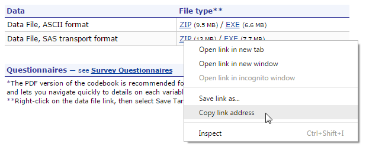

# Analyzing MEPS data using R

This repository is intended to provide example R code for those interested in analyzing data from the Agency for Healthcare Research and Quality's (AHRQ) Medical Expenditure Panel Survey (MEPS). 

The following codes are available:
* [loading_MEPS.R](loading_MEPS.R): example code to download MEPS files from [the MEPS website](https://meps.ahrq.gov/mepsweb/data_stats/download_data_files.jsp).
* [example1.R](example_1.R): code to re-create some of the estimates from the [MEPS summary table for 2013 data.](https://meps.ahrq.gov/mepsweb/data_stats/tables_compendia_hh_interactive.jsp?_SERVICE=MEPSSocket0&_PROGRAM=MEPSPGM.TC.SAS&File=HCFY2013&Table=HCFY2013_PLEXP_%40&VAR1=AGE&VAR2=SEX&VAR3=RACETH5C&VAR4=INSURCOV&VAR5=POVCAT13&VAR6=REGION&VAR7=HEALTH&VARO1=4+17+44+64&VARO2=1&VARO3=1&VARO4=1&VARO5=1&VARO6=1&VARO7=1&_Debug=).
* [example2.R](example_2.R): code to re-create the data and plot for Figure 1 in [Statistical brief \#491](https://meps.ahrq.gov/data_files/publications/st491/stat491.shtml).

> **Note to user**: AHRQ cannot guarantee the quality of your analyses. It is the user's responsibility to verify that the intended estimates are accurate

# Getting Started
[Loading R packages](#loading-packages)

[Loading MEPS data](#loading-meps-data)
* [From a local directory](#from-a-local-directory)
* [Directly from the MEPS website](#directly-from-the-meps-website)

[Analyzing MEPS data](#analyzing-meps-data)
* [Survey package in R](#survey-package-in-R)
* [Defining the survey object](defining-the-survey-object)

## Loading R packages

Code for this section is also available in [loading_MEPS.R](loading_MEPS.R).

To load MEPS data, we first need to load some additional packages into R. We will need the foreign package, which allows R to read SAS transport files. The `install.packages` function only needs to be run once (to download the package from the internet and store it on your computer). Typically, this is done with the command `install.packages("foreign")`. The `library` function needs to be run every time you re-start your R session.

``` r
 install.packages("foreign")  # Only need to run these once
 install.packages("survey")
 
 library(foreign) # Run these every time you re-start R
 library(survey)
```
> **Installing and Loading Packages**: Packages are sets of R functions that are downloaded and installed into the R system. A library only needs to be installed once per R installation. However, the `library` function needs to be run every time you re-start your R session to load the package. Packages are tailor made to help perform certain statistical, graphical, or data tasks. Since R is used by many analysts, it is typical for only some packages to be loaded for each analysis. 

## Loading MEPS data

We will need to load the data from the MEPS website into R. The data will be stored in a *data.frame* called `FYC2013`. We chose this name since we are retrieving the 'Full Year Consolidated' file for the year 2013.

### From a local directory

If you have manually downloaded and unzipped the MEPS .ssp data file to a local directory, you should save it to your local system. Here's an example where the files are stored at "C:\\MEPS\\SASDATA\\h163.ssp" on a Windows system:


<br>
The following code will load the data, using the foreign package function `read.xport`:
``` r
FYC2013 = read.xport("C:/MEPS/SASDATA/h163.ssp")
```
The object **FYC2013** is now loaded into R's memory as a data frame. 

> Warning! Be aware the directory names need to be separated by a slash ("/") or a double backslash ("\\\\"). This is because the single backslash is almost universally used as an string escape character in computing.

### Directly from the MEPS website

Data downloading tasks can also be automated using R. This offers several advantages when:

1. a large number of files need to be downloaded
2. another researcher needs to verify which files were downloaded (and from where)
3. data files might be updated periodically

To do this, use the `download.file` function to save the zip file from the MEPS website to the temporary file `temp`. Then use the `unzip` and `read.xport` functions to unzip and load the SAS transport data into R as a data frame.

``` r
download.file("https://meps.ahrq.gov/mepsweb/data_files/pufs/h163ssp.zip", temp <- tempfile())
unzipped_file = unzip(temp)
FYC2013 = read.xport(unzipped_file)
unlink(temp)  # Unlink to delete temporary file
```
> To get the file location for a specific dataset, right-click on the ZIP link, then select 'Copy link address' to copy the location to your the clipboard.  
 


# Analyzing MEPS data

Because MEPS is a nationally-representative probability-based sample, survey methods must be used to estimate appropriate standard errors. In R, the easiest way to do this is to use the survey package. For code to load the survey package, refer to [Loading R packages](#loading-R-packages).

## Survey package in R

The survey package contains functions for analyzing survey data by defining a **survey design object** with information about the sampling procedure, then running analyses on that object. Here are some of the functions in the survey package that are most useful for analyzing data from MEPS.

*   `svydesign`: define the survey object
*   `svytotal`: population totals
*   `svymean`: proportions and means
*   `svyquantile`: quantiles (e.g. median)
*   `svyratio`: ratio statistics (e.g. percentage of total expenditures)
*   `svyglm`: generalized linear regression
*   `svyby`: run other survey functions by group

## Defining the survey object

To use functions in the survey package, the `svydesign` function specifies the primary sampling unit, the strata, and the sampling weights for the data frame. The function also allows for nested designs. The following code should be followed to create the appropriate sampling design object for MEPS data. The weight variable `PERWT13F` will be different depending on the year (e.g. `PERWT14F` for 2014 data), and the dataset name will be different depending on the specified name
``` r
mepsdsgn = svydesign(id = ~VARPSU, 
                     strata = ~VARSTR, 
                     weights = ~PERWT13F, 
                     data = FYC2013, 
                     nest = TRUE)  
```
Once the survey design object is defined, population estimates can be calculated using functions from the suvey package. For example, the following code will calculate the average healthcare expenditure per person in 2013:
```r
svymean(~TOTEXP13,design = mepsdsgn)  
```
Additinoal examples of using these survey functions are provided in [example1.R](example1.R) and [example2.R](example2.R).


