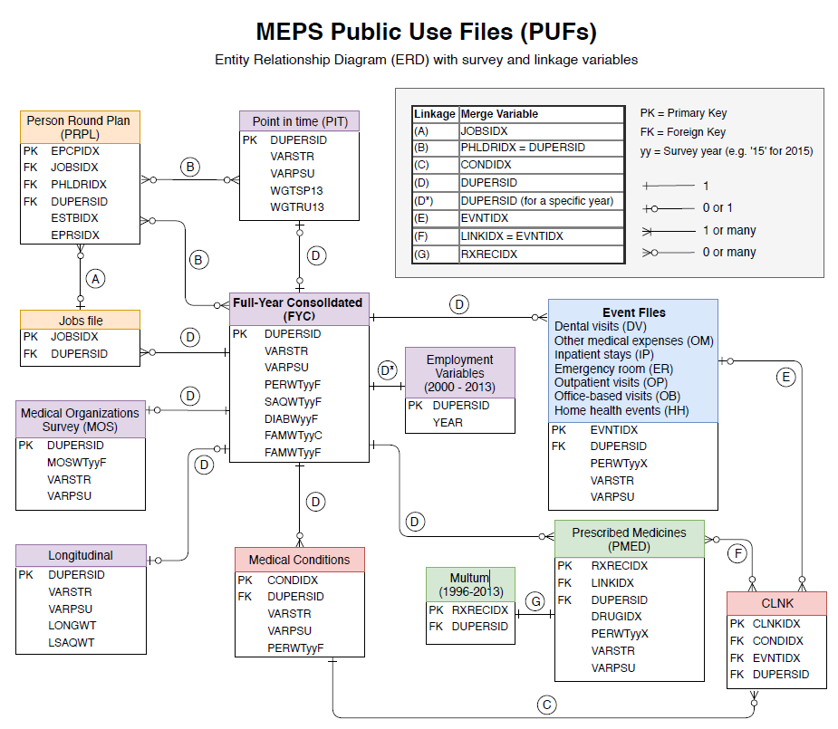

# MEPS quick reference guides

The following reference guides are provided for convenience:

[Condition Codes](#condition-codes)
 
[Entity Relationship Diagram](#entity-relationship-diagram)
 
[File names](#file-names)
 
[Programming Statements](#programming-statements)
 
[Variable Names](#variable-names)

## Condition Codes

From 1996-2015, household-reported medical conditions in MEPS were coded into ICD-9 codes, which were then collapsed into the broader Clinical Classification Software (CCS) codes created by the Healthcare Cost and Utilization Project (HCUP). Starting in 2016, medical conditions were coded into ICD-10 codes, then collapsed into CCS-Refined (CCSR) codes provided by HCUP.

For analytical purposes (including the creation of the [MEPS-HC Data Tools](https://datatools.ahrq.gov/meps-hc)), MEPS created even broader condition categories. Some of these collapsed condition categories were revised with the transition from ICD-9 to ICD-10 in 2016. The following spreadsheets provide crosswalks between CCS[R] and MEPS collapsed condition categories, the list of collapsed condition categories that were revised in 2016, and descriptive labels for the 3-digit top-coded ICD variables on the MEPS Conditions files (ICD9CODX for 1996-2015; ICD10CDX for 2016 and later).

* [meps_ccs_conditions.csv](meps_ccs_conditions.csv): CCS - Collapsed Condition crosswalk (1996-2015)
* [meps_ccsr_conditions.csv](meps_ccsr_conditions.csv): CCSR - Collapsed Condition crosswalk (2016 and later)
* [meps_cond_icd9_labels.csv](meps_cond_icd9_labels.csv): Labels for ICD9CODX (1996-2015)
* [meps_cond_icd10_labels.csv](meps_cond_icd10_labels.csv): Labels for ICD10CDX (2016 and later)
* [meps_condition_changes.csv](meps_condition_changes.csv): Differences between MEPS collapsed condition categories from 1996-2015 compared with 2016 and later.

The HCUP website provides more information on the creation of [CCS for ICD-9 codes](https://www.hcup-us.ahrq.gov/toolssoftware/ccs/ccs.jsp) and [CCSR for ICD-10 codes](https://www.hcup-us.ahrq.gov/toolssoftware/ccsr/ccs_refined.jsp).

## Entity Relationship Diagram
[meps_erd.pdf](meps_erd.pdf) is a printable entity relationship diagram of the most commonly used MEPS public use files (PUFs). Short descriptions of the datasets and example programming codes in SAS, R, and Stata are available on page 2.

## File names
[meps_file_names.csv](meps_file_names.csv) lists the names of the MEPS Public Use Files (PUFs). These can be helpful when users are downloading MEPS datasets programatically. Longitudinal files are split into separate columns, since these files span multiple years of data.

**Abbreviations used in file:**
* CLNK:	Condition Event Link file
* FS:	Food Security file
* FYC: 	Full-Year-Consolidated
* Long: Longitudinal
* MOS:	Medical Organizations Survey
* PIT:	Point-in-time
* PMED:	Prescription Medicines
* PRPL: Person-Round-Plan
* PSAQ:	Preventive Care Self-Administered Questionnaire
* RXLK: Prescribed Medicines Link file

## Programming Statements
[meps_programming_statements.md](meps_programming_statements.md) offers a quick reference of programming statements needed to analyze MEPS data using survey methods in R, SAS, and Stata.

## Variable Names
[meps_variables.md](meps_variables.md) is a guide for identifying variable names of utilization and  expenditure variables by source of payment in the [MEPS Full-Year-Consolidated (FYC) files](https://meps.ahrq.gov/mepsweb/data_stats/download_data_files_results.jsp?cboDataYear=All&cboDataTypeY=1%2CHousehold+Full+Year+File&buttonYearandDataType=Search&cboPufNumber=All&SearchTitle=Consolidated+Data).

