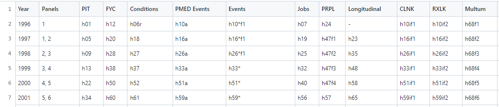

# MEPS quick reference guides

The following reference guides are provided for convenience:

## Condition Codes

[meps_condition_codes.csv](meps_condition_codes.csv) provides a cross-reference between [collapsed condition categories](https://meps.ahrq.gov/survey_comp/MEPS_condition_data.pdf) commonly used in MEPS analyses and [Clinical Classification Software (CCS) Codes](https://www.hcup-us.ahrq.gov/toolssoftware/ccs/ccs.jsp#download). Information on how CCS codes relate to [ICD-9](https://www.hcup-us.ahrq.gov/toolssoftware/ccs/ccs.jsp) and [ICD-10](https://www.hcup-us.ahrq.gov/toolssoftware/ccs10/ccs10.jsp) codes is available on the HCUP website.

## File names
[meps_file_names.csv](meps_file_names.csv) lists the names of the MEPS Public Use Files (PUFs). These can be helpful when users are downloading MEPS datasets programatically.

## Programming Statements
[meps_programming_statements.md](meps_programming_statements.md) offers a quick reference of programming statements needed to analyze MEPS data using survey methods in R, SAS, and Stata.

## Variable Names
[meps_variables.md](meps_variables.md) is a guide for identifying variable names of utilization and  expediture variables by source of payment in the [MEPS Full-Year-Consolidated (FYC) files](https://meps.ahrq.gov/mepsweb/data_stats/download_data_files_results.jsp?cboDataYear=All&cboDataTypeY=1%2CHousehold+Full+Year+File&buttonYearandDataType=Search&cboPufNumber=All&SearchTitle=Consolidated+Data). For example, 'TOTEXP14' is the variable name for total expenditures per person in 2014, while 'OBVSLF14' is the variable name for out-of-pocket payments for office-based doctor's visits per person in 2014.

