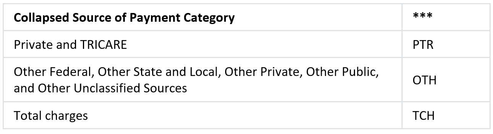

The following tables provide a quick reference to identify the variable names for utilization and expenditure variables on the MEPS Full Year Consolidated (FYC) Public Use Files (PUFs). Note that not all of the listed variables are available on every FYC file. Data and corresponding documentation are available on [the MEPS website](https://meps.ahrq.gov/mepsweb/data_stats/download_data_files_results.jsp?cboDataYear=All&cboDataTypeY=1%2CHousehold+Full+Year+File&buttonYearandDataType=Search&cboPufNumber=All&SearchTitle=Consolidated+Data).

### Utilization and Expenditure Variables

To complete the variable name in the following table, replace 'yy' with the two-digit code for year (e.g. '14' for data year 2014) and replace '**\*' with a particular source of payment category as identified in the '[Source of Payment Keys](#source-of-payment-keys)' table.

### Source of Payment Keys

To complete variable name in the '[Utilization and Expenditure Variables](#utilization-and-expenditure-variables)' table above, replace **\* with a particular source of payment category as identified in the following tables:

