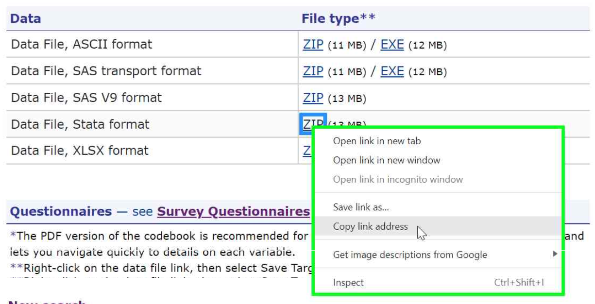

# Analyzing MEPS data using R <!-- omit in toc -->

- [Loading R packages](#loading-r-packages)
- [Loading MEPS data](#loading-meps-data)
  - [All data years: Using the `MEPS` package](#all-data-years-using-the-meps-package)
  - [Data years 2017 and later: ASCII, SAS V9, Stata, and XLSX](#data-years-2017-and-later-ascii-sas-v9-stata-and-xlsx)
  - [Data years 1996-2016: SAS XPORT format](#data-years-1996-2016-sas-xport-format)
- [Automating file download](#automating-file-download)
- [Saving R data (.Rdata)](#saving-r-data-rdata)
- [Survey package in R](#survey-package-in-r)
- [R examples](#r-examples)
  - [Workshop exercises](#workshop-exercises)
  - [Summary tables examples](#summary-tables-examples)


# Loading R packages

> Note: R version 4.0.4 or later is recommended.

To load and analyze MEPS data in R, additional packages are needed. Packages are sets of R functions that are downloaded and installed into the R system. A package only needs to be installed once per R installation. Typically, this is done with the `install.packages` function to download the package from the internet and store it on your computer. The `library` function needs to be run every time the R session is re-started. Packages are tailor-made to help perform certain statistical, graphical, or data tasks. Since R is used by many analysts, it is typical for only some packages to be loaded for each analysis.

``` r
# Only need to run these once:
  install.packages("foreign")  
  install.packages("devtools")
  install.packages("tidyverse")
  install.packages("readr")
  install.packages("readxl")
  install.packages("haven")
  install.packages("survey")

# Run these every time you re-start R:
  library(foreign)
  library(devtools)
  library(tidyverse)
  library(readr)
  library(readxl)
  library(haven)
  library(survey)
```

# Loading MEPS data

For data years 2017 and later (and also for the 2016 Medical Conditions file), .zip files for multiple file formats are available, including ASCII (.dat), SAS V9 (.sas7bdat), Stata (.dta), and Excel (.xlsx). Prior to 2017, ASCII (.dat) and SAS transport (.ssp) files are provided for all datasets. 

Different functions are needed for importing these various file formats into R. The most versatile method is to use the `read_MEPS` function from the [`MEPS` package](https://github.com/e-mitchell/meps_r_pkg)</b>, which was created to facilitate loading and manipulation of MEPS PUFs. For users that prefer not to use the MEPS R package to load MEPS public use files, care must be taken to ensure that the correct file format is being imported in accordance with the data year, as detailed in the sections below. 

The following table summarizes the recommended functions and R packages needed to load the various file formats into R:

| File type          | Package   | Function     | Example |
| ---------          | :---:     | :---:        | --------|
| All types          | `MEPS`    | `read_MEPS`  | `read_MEPS(year=2017, type="DV")` |
| ASCII (.dat)       | `readr`   | `read_fwf`   | `read_fwf("C:/MEPS/h206b.dat", col_positions,  col_types)`      |
| Excel (.xlsx)      | `readxl`  | `read_excel` | `read_excel("C:/MEPS/h206b.xlsx")`|
| SAS V9 (.sas7bdat) | `haven`   | `read_sas`   | `read_sas("C:/MEPS/h206b.sas7bdat")` |
| SAS XPORT (.ssp)   | `foreign` | `read.xport` | `read.xport("C:/MEPS/h188b.ssp")` |
| SAS CPORT (.ssp)   | (none)       | N/A       | N/A
| Stata (.dta)       | `haven`   | `read_dta`   | `read_dta("C:/MEPS/h206b.dta")` |


## All data years: Using the `MEPS` package

The MEPS R Package was created to facilitate loading and manipulation of MEPS PUFs. It can be installed using the following commands:
``` r
library(devtools)

install_github("e-mitchell/meps_r_pkg/MEPS")
library(MEPS)
```

The `read_MEPS` function can then be used to import MEPS data into R directly from the MEPS website. This function automatically detects the best file format to import based on the specified data year and file.

In the following example, the 2016 (h188b), 2017 (h197b), and 2018 (h206b) Dental Visits files are automatically downloaded from the MEPS website and imported into R. Either the file name or the year and MEPS data type can be specified:

``` r
# Specifying year and MEPS data type
dn2016 = read_MEPS(year = 2016, type = "DV")
dn2017 = read_MEPS(year = 2017, type = "DV")
dn2018 = read_MEPS(year = 2018, type = "DV")

# Specifying MEPS file name
dn2016 = read_MEPS(file = "h188b")
dn2017 = read_MEPS(file = "h197b")
dn2018 = read_MEPS(file = "h206b")

# Access the help page for a full list of allowable "type" values:
help(read_MEPS)
```


## Data years 2017 and later: ASCII, SAS V9, Stata, and XLSX

For users that prefer not to use the `MEPS` package, multiple data formats are available for MEPS public use files from data years 2017 and later (and also for the 2016 Medical Conditions file). Due to the fast loading speed and simplicity of code, the <b>Stata data format (.dta)</b> is the recommended file format.

> <b> IMPORTANT! </b> SAS transport (.ssp) versions of most these files were created using the SAS CPORT engine. These CPORT data files cannot be read directly into R, and alternative file formats must be used instead.

Examples of loading each of the available file types are detailed below. For each example, the 2018 Dental Visits files (<b>h206b</b>) has been [downloaded from the MEPS website](https://meps.ahrq.gov/mepsweb/data_stats/download_data_files_detail.jsp?cboPufNumber=HC-206B), unzipped, and saved in the local directory <b>C:/MEPS</b>:

<b> Stata (.dta) files -- recommended</b>

Stata files can be loaded into R using the `read_dta` function from the `haven` package. These are the recommended file formats, since Stata files are generally the fastest to load into R among the available formats.
``` r
library(haven)
dn2018 = read_dta("C:/MEPS/h206b.dta")
```

<b>SAS V9 (.sas7bdat) files</b>

SAS V9 files can be loaded into R using the `read_sas` function from the `haven` package:
``` r
library(haven)
dn2018 = read_sas("C:/MEPS/h206b.sas7bdat")
```

<b>ASCII (.dat) files</b>

ASCII (.dat) fixed-width files can be loaded into R using the `read_fwf` function from the `readr` package. Additional instructions for loading these ASCII files into R can be found in the 'R Programming Statements' text file link provided with each data file release. For example, the R programming statements for the 2018 Dental Visits file can be viewed here: https://meps.ahrq.gov/data_stats/download_data/pufs/h206b/h206bru.txt

<b> Excel (.xlsx) files </b>

Excel files can be read into R using the `read_excel` function from the `readxl` package. However, some of the larger files (e.g. FYC, Longitudinal) can require a longer time to load, so this method is not recommended.
``` r
library(readxl)
dn2018 = read_excel("C:/MEPS/h206b.xlsx")
```


<!-- > I think I don't want to include so much info here, since this is not the best method...


``` r
## Load the 2018 Conditions-event link (CLNK) file:

# Define start and end positions to read fixed-width file 
pos_start = c(1, 11, 24, 40, 69, 70)
pos_end   = c(10, 23, 39, 68, 69, 71)

# Define variable names and types ('c' = character, 'n' = 'numeric') 
var_types = c("DUPERSID"="c", "CONDIDX"="c", "EVNTIDX"="c", "CLNKIDX"="c", "EVENTYPE"="n", "PANEL"="n")
var_names = names(var_types)

# IMPORT ASCII (.dat) file 
h206if1 = read_fwf(
  "C:/MEPS/h206if1.dat",
  col_positions = 
    fwf_positions(
      start = pos_start, 
      end   = pos_end, 
      col_names = var_names),
  col_types = var_types)

```

The required programming statements are available for each data file from 2018 and later (with the exceptions as noted above), and can be copied and pasted from the link provided with each file.

Alternatively, these R programming statements can be called directly 

In this example, the ASCII file h207.dat has been downloaded from the MEPS website, unzipped, and saved in the local directory C:/MEPS. The 2018 Medical Conditions ASCII file (h207.dat) is then imported by running the R programming statements provided on the MEPS website.
``` r
# Set the location of the .dat file
meps_path = "C:/MEPS/h207.dat"  

# Run the R programming statements
source("https://meps.ahrq.gov/mepsweb/data_stats/download_data/pufs/h207/h207ru.txt")

# View data
head(h207) 
```
<-->

## Data years 1996-2016: SAS XPORT format

For data years prior to 2017, ASCII and SAS transport (XPORT) file formats were released for the MEPS public use files. Since the required R programming statements are not available for the ASCII data files for these years, the <b>SAS transport (.ssp)</b> formats are the recommended file type (excluding the 2016 Medical Conditions file).

These files can be read into R using the `read.xport` function from the `foreign` package.  In the following example, the SAS XPORT format of the 2016 Dental Visits file (<b>h188b.ssp</b>) has been downloaded from the MEPS website, unzipped, and saved in the local directory <b>C:/MEPS</b>.

```r
library(foreign)
dn2016 = read.xport("C:/MEPS/h188b.ssp")
```

# Automating file download

Instead of manually downloading, unzipping, and storing MEPS data files in a local directory, it may be beneficial to automatically download MEPS data directly from the MEPS website. This can be accomplished using the `download.file` and `unzip` functions. The following code downloads and unzips the 2018 Dental Visits file (h206b), and stores it in a temporary folder (alternatively, the file can be stored permanently by editing the `exdir` argument). The file can then be loaded into R using the appropriate function (e.g. `read_dta` for the Stata file format). The following example demonstrates this process for the Stata file (.dta):
``` r
# Load 'haven' library for 'read_dta' function
library(haven)

# Download Stata (.dta) zip file
url = "https://meps.ahrq.gov/mepsweb/data_files/pufs/h206b/h206bdta.zip"
download.file(url, temp <- tempfile())

# Unzip and save to temporary folder
meps_file = unzip(temp, exdir = tempdir())

# Alternatively, this will save a permanent copy of the file to the local folder "C:/MEPS/R-downloads"
# meps_file = unzip(temp, exdir = "C:/MEPS/R-downloads")

# Read the .dta file into R 
dn2018 = read_dta(meps_file)
```

To download additional files programmatically, replace 'h206b' in the above code with the desired filename (see [meps_files_names.csv](https://github.com/HHS-AHRQ/MEPS/blob/master/Quick_Reference_Guides/meps_file_names.csv) for a list of MEPS file names by data type and year). The full URL of each zip file can be found by right-clicking the 'ZIP' hyperlink on the web page for the data file, selecting 'Copy link address', then pasting into a text editor or code editor.



# Saving R data (.Rdata)

Once the MEPS data has been loaded into R, it can be saved as a permanent R dataset (.Rdata) for faster loading. In the following code, the 2018 Dental Visits dataset is saved to the C:/ drive (first create the 'MEPS/R/data' folder if needed):
``` r
save(dn2018, file = "C:/MEPS/R/data/dn2018.Rdata")
```
This dataset can then be loaded into subsequent R sessions using the code:
``` r
load(file = "C:/MEPS/R/data/dn2018.Rdata")
```


# Survey package in R
To analyze MEPS data using R, the [`survey` package](https://cran.r-project.org/web/packages/survey/survey.pdf) should be used to ensure unbiased estimates. The survey package contains functions for analyzing survey data by defining a **survey design object** with information about the sampling procedure, then running analyses on that object. Some of the functions in the survey package that are most useful for analyzing MEPS data include:

*   `svydesign`: define the survey object
*   `svytotal`: population totals
*   `svymean`: proportions and means
*   `svyquantile`: quantiles (e.g. median)
*   `svyratio`: ratio statistics (e.g. percentage of total expenditures)
*   `svyglm`: generalized linear regression
*   `svyby`: run other survey functions by group

To use functions in the survey package, the `svydesign` function specifies the primary sampling unit, the strata, and the sampling weights for the data frame. The `survey.lonely.psu='adjust'` option ensures accurate standard error estimates when analyzing subsets. Once the survey design object is defined, population estimates can be calculated using functions from the survey package. As an example, the following code will estimate total dental expenditures in 2018:
``` r
library(survey)

options(survey.lonely.psu='adjust')

mepsdsgn = svydesign(
  id = ~VARPSU,
  strata = ~VARSTR,
  weights = ~PERWT18F,
  data = dn2018,
  nest = TRUE)  

svytotal(~DVXP18X, design = mepsdsgn)
```

# R examples

In order to run the example codes, you must download the relevant MEPS files from the MEPS website and save them to your local computer. The codes are written under the assumption that these files are saved in the local directory "C:/MEPS/". However, the programs can be customized to point to an alternate directory as desired.


## Workshop exercises
The following codes from previous MEPS workshops are provided in the [workshop_exercises](workshop_exercises) folder:


### 1. National health care expenses <!-- omit in toc -->
[exercise_1a.R](workshop_exercises/exercise_1a.R): National health care expenses by age group, 2016
<br>
[exercise_1b.R](workshop_exercises/exercise_1b.R): National health care expenses by age group, 2018
<br>

### 2. Prescribed medicine purchases <!-- omit in toc -->
[exercise_2a.R](workshop_exercises/exercise_2a.R): Purchases and expenses for narcotic analgesics or narcotic analgesic combos, 2016
<br>
[exercise_2b.R](workshop_exercises/exercise_2b.R): Purchases and expenses for narcotic analgesics or narcotic analgesic combos, 2018
<br>

### 3. Pooling data files <!-- omit in toc -->
[exercise_3a.R](workshop_exercises/exercise_3a.R): Pooling MEPS FYC files, 2015 and 2016: Out-of-pocket expenditures for unisured persons ages 26-30 with high income
<br>
[exercise_3b.R](workshop_exercises/exercise_3b.R):  Pooling longitudinal files, panels 17-19
<br>
[exercise_3c.R](workshop_exercises/exercise_3c.R): Pooling MEPS FYC files, 2017 and 2018: People with joint pain, using JTPAIN31 for 2017 and JTPAIN31_M18 for 2018
<br>
[exercise_3d.R](workshop_exercises/exercise_3d.R): Pooling MEPS FYC files, 2017-2019: People with joint pain, using [Pooled Linkage Variance file](https://meps.ahrq.gov/mepsweb/data_stats/download_data_files_detail.jsp?cboPufNumber=HC-036) for correct standard error calculation (required when pooling before and after 2019)
<br>


### 4. Regression <!-- omit in toc -->
[exercise_4a.R](workshop_exercises/exercise_4a.R): Logistic regression to identify demographic factors associated with receiving a flu shot in 2018 (using SAQ population)
<br>
[exercise_4b.R](workshop_exercises/exercise_4b.R): Logistic regression for persons that delayed medical care because of COVID, 2020
<br>

### 5. Plots <!-- omit in toc -->
[ggplot_example.R](workshop_exercises/ggplot_example.R): Code to re-create the data and plot for Figure 1 in [Statistical brief \#491](https://meps.ahrq.gov/data_files/publications/st491/stat491.shtml).


## Summary tables examples

The following codes provided in the [summary_tables_examples](summary_tables_examples) folder re-create selected statistics from the [MEPS-HC Data Tools](https://datatools.ahrq.gov/meps-hc):

### Accessibility and Quality of Care  <!-- omit in toc -->

#### Access to Care <!-- omit in toc -->
[care_access_2017.R](summary_tables_examples/care_access_2017.R):
Reasons for difficulty receiving needed care, by poverty status, 2017
<br>
[care_access_2019.R](summary_tables_examples/care_access_2019.R):
Number and percent of people who did not receive treatment because they couldn't afford it, by poverty status, 2019

#### Diabetes Care <!-- omit in toc -->
[care_diabetes_a1c_2016.R](summary_tables_examples/care_diabetes_a1c_2016.R): Adults with diabetes receiving hemoglobin A1c blood test, by race/ethnicity, 2016

#### Quality of Care <!-- omit in toc -->
[care_quality_2016.R](summary_tables_examples/care_quality_2016.R): Ability to schedule a routine appointment, by insurance coverage, 2016


### Medical conditions <!-- omit in toc -->
[cond_expenditures_2015.R](summary_tables_examples/cond_expenditures_2015.R): Utilization and expenditures by medical condition, 2015 -- Conditions defined by collapsed ICD-9/CCS codes
<br>
[cond_expenditures_2018.R](summary_tables_examples/cond_expenditures_2018.R): Utilization and expenditures by medical condition, 2018 -- Conditions defined by collapsed ICD-10/CCSR codes


### Health Insurance <!-- omit in toc -->
[ins_age_2016.R](summary_tables_examples/ins_age_2016.R): Health insurance coverage by age group, 2016


### Prescribed drugs <!-- omit in toc -->
[pmed_prescribed_drug_2016.R](summary_tables_examples/pmed_prescribed_drug_2016.R): Purchases and expenditures by generic drug name, 2016
<br>
[pmed_therapeutic_class_2016.R](summary_tables_examples/pmed_therapeutic_class_2016.R): Purchases and expenditures by Multum therapeutic class, 2016


### Use, expenditures, and population <!-- omit in toc -->
[use_events_2016.R](summary_tables_examples/use_events_2016.R): Number of events and mean expenditure per event, for office-based and outpatient events, by source of payment, 2016
<br>
[use_expenditures_2016.R](summary_tables_examples/use_expenditures_2016.R): Expenditures for office-based and outpatient visits, by source of payment, 2016
<br>
[use_expenditures_2019.R](summary_tables_examples/use_expenditures_2019.R): Mean expenditure per person, by event type and source of payment, 2019.
<br>
[use_race_sex_2016.R](summary_tables_examples/use_race_sex_2016.R): Utilization and expenditures by race and sex, 2016
