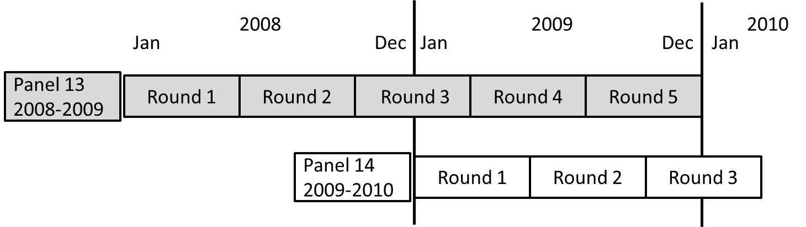

# About MEPS

The Medical Expenditure Panel Survey, which began in 1996, is a set of large-scale surveys of families and individuals, their medical providers (doctors, hospitals, pharmacies, etc.), and employers across the United States. MEPS collects data on the specific health services that Americans use, how frequently they use them, the cost of these services, and how they are paid for, as well as data on the cost, scope, and breadth of health insurance held by and available to U.S. workers.

## MEPS-HC
The <b>MEPS Household Component (MEPS-HC)</b> survey collects information from families and individuals that provides timely, comprehensive information on the health status of Americans, health insurance coverage, and access, use, and cost of health services. The MEPS-HC includes information on medical expenditures, conditions, and events; demographics (for example, age, ethnicity, and income); health insurance coverage; access to care; health status; and jobs held. Each surveyed household is interviewed five times over a two-year period:

Data from the Household Component are [available to the public](https://meps.ahrq.gov/mepsweb/data_stats/download_data_files.jsp).

### Programming examples

This repository provides example code for loading and analyzing data from the <b>Household Component</b> of MEPS:

* The [R folder](R) has example code for loading and analyzing MEPS data using R.

* The [SAS folder](SAS) contains example code for analyzing MEPS data using SAS.

* The [Stata folder](Stata) has example code for analyzing MEPS data using Stata.

> **Note to User**: The provided code is intended as examples of using common software packages to load and analyze MEPS data. AHRQ cannot certify the quality of your analysis. You are responsible for ensuring appropriateness of sample sizes, statistical significance, and overall reasonableness.

### Quick reference guides

Several quick reference guides are also provided in this repository for convenience:

* **Condition Codes**: [meps_condition_codes.csv](meps_condition_codes.csv) provides a cross-reference between [collapsed condition categories](https://meps.ahrq.gov/survey_comp/MEPS_condition_data.pdf) commonly used in MEPS analyses and [Clinical Classification Software (CCS) Codes](https://www.hcup-us.ahrq.gov/toolssoftware/ccs/ccs.jsp#download). Information on how CCS codes relate to [ICD-9](https://www.hcup-us.ahrq.gov/toolssoftware/ccs/ccs.jsp) and [ICD-10](https://www.hcup-us.ahrq.gov/toolssoftware/ccs10/ccs10.jsp) codes is available on the HCUP website.

* **File Names**: [meps_file_names.csv](meps_file_names.csv) lists the names of the MEPS Public Use Files (PUFs). These can be helpful when users are downloading MEPS datasets programatically.

* **Programming Statements**: [meps_programming_statements.md](meps_programming_statements.md) offers a quick reference of programming statements needed to analyze MEPS data using survey methods in R, SAS, and Stata.

* **Variable Names**: [meps_variables.md](meps_variables.md) is a guide for identifying variable names of utilization and  expediture variables by source of payment in the [MEPS Full-Year-Consolidated (FYC) files](https://meps.ahrq.gov/mepsweb/data_stats/download_data_files_results.jsp?cboDataYear=All&cboDataTypeY=1%2CHousehold+Full+Year+File&buttonYearandDataType=Search&cboPufNumber=All&SearchTitle=Consolidated+Data). For example, 'TOTEXP14' is the variable name for total expenditures per person in 2014, while 'OBVSLF14' is the variable name for out-of-pocket payments for office-based doctor's visits per person in 2014.

## Additional Survey Components
MEPS is comprised of two additional components: The <b>MEPS Medical Provider Component (MEPS-MPC)</b> and the <b>MEPS Insurance Component (MEPS-IC)</b>. The MEPS-MPC survey collects information from providers of medical care that supplements the information collected from persons in the MEPS-HC sample in order to provide the most accurate cost data possible. The MEPS-IC survey collects information from employers in the private sector and state and local governments on the health insurance coverage offered to their employees. It also includes information on the number and types of private health insurance plans offered, benefits associated with these plans, annual premiums and contributions to premiums by employers and employees, copayments and coinsurance, by various employer characteristics (for example, State, industry and firm size).

These datasets are not available to the public. Access to the MEPS-MPC data can be requested from the [AHRQ data center](https://meps.ahrq.gov/mepsweb/data_stats/onsite_datacenter.jsp). For access to the MEPS-IC data, visit the [Census Bureau's data center website](http://www.census.gov/ces/rdcresearch/).
