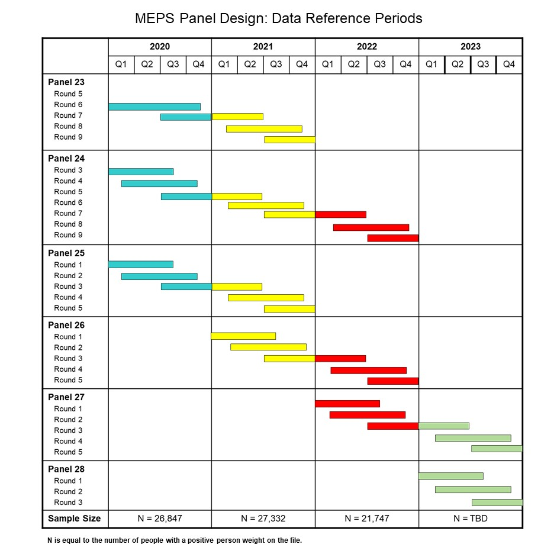
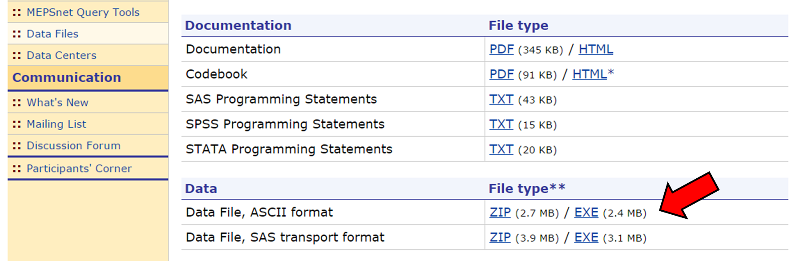
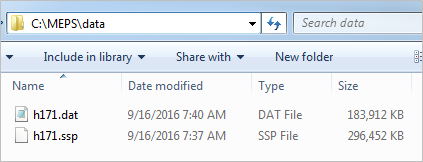

# Medical Expenditure Panel Survey (MEPS)

This repository contains instructions and example code for loading and analyzing data from the Agency for Healthcare Research and Quality's [Medical Expenditure Panel Survey](https://meps.ahrq.gov/mepsweb/) (MEPS) <b>Household Component</b> (HC), as well as presentation slides from the most recent MEPS Workshop. [Quick reference guides](Quick_Reference_Guides) are also provided for convenience.

[MEPS Workshops](#meps-workshops)  
[Survey Background](#survey-background)  
[Accessing MEPS-HC data](#accessing-meps-hc-data)  
[Analyzing MEPS-HC data](#analyzing-meps-hc-data)  
[Additional Survey Components](#additional-survey-components)  
[Contact MEPS](#contact-meps)

<b>Example code</b> for loading and analyzing MEPS data in R, SAS, and Stata is available in the following folders:
 * [R](R)  
 * [SAS](SAS)  
 * [Stata](Stata)  

## MEPS Workshops

The Agency for Healthcare Research and Quality (AHRQ) conducts several workshops throughout the year. These workshops provide extended knowledge about MEPS data, practical information about usage of MEPS public use data files and an opportunity to construct analytic files with the assistance of AHRQ staff. The workshops are designed for health services researchers who have a background or interest in using national health surveys. For questions regarding MEPS Workshops, please contact Anita Soni at [WorkshopInfo@ahrq.hhs.gov](mailto:WorkshopInfo@ahrq.hhs.gov).

The agenda and presentation slides for the <b>MEPS Spring Workshop (April 24, 2017)</b> are available in the [Workshop](Workshop) folder. Programming exercises presented during the workshop are located in the [R](R), [SAS](SAS), and [Stata](Stata) folders.

Information on upcoming workshops is posted on the [MEPS website](https://meps.ahrq.gov/about_meps/workshops_events.jsp). Check back regularly for updates.

## Survey Background
The Medical Expenditure Panel Survey, which began in 1996, is a set of large-scale surveys of families and individuals, their medical providers (doctors, hospitals, pharmacies, etc.), and employers across the United States. The <b>MEPS Household Component (MEPS-HC)</b> survey collects information from families and individuals pertaining to medical expenditures, conditions, and events; demographics (e.g., age, ethnicity, and income); health insurance coverage; access to care; health status; and jobs held. Each surveyed household is interviewed five times (rounds) over a two-year period:

The MEPS-HC is designed to produce national and regional estimates of the health care use, expenditures, sources of payment, and insurance coverage of the <b>U.S. civilian noninstitutionalized population</b>. The sample design of the survey includes weighting, stratification, clustering, multiple stages of selection, and disproportionate sampling.

## Accessing MEPS-HC data

Data from the Household Component of MEPS are [available for download](https://meps.ahrq.gov/mepsweb/data_stats/download_data_files.jsp) as public use files. Each dataset contains .zip and .exe files in ASCII and SAS transport format.

To download the data, unzip and save the ASCII (.dat) or SAS transport (.ssp) file to your local computer. For example, the 2014 full-year-consolidated files <b>h171.dat</b> and <b>h171.ssp</b> can be stored in a local directory <b>'C:\MEPS\data'</b>:

The steps for loading the .dat or .ssp files depends on the programming language being used. Code for loading .ssp files in [R](R), [SAS](SAS), and [Stata](Stata) are available in the corresponding folders.

## Analyzing MEPS-HC data
The complex survey design of MEPS requires special methods for analyzing MEPS data. These tools are available in many common programming languages including R, SAS, and Stata. Failure to account for the survey design can result in biased estimates. Details and examples of using the appropriate survey methods are provided for [R](R), [SAS](SAS), and [Stata](Stata). Additional examples comparing these three languages can be found in the quick reference guide [meps_programming_statements.md](Quick_Reference_Guides/meps_programming_statements.md).

> **Note to User**: All code provided in this repository is intended as an example for loading and analyzing MEPS data. AHRQ cannot certify the quality of your analysis. It is the user's responsibility to verify the accuracy of the results.

## Additional Survey Components
In addition to the Household Component (MEPS-HC), MEPS is comprised of two additional components: The <b>MEPS Medical Provider Component (MEPS-MPC)</b> and the <b>MEPS Insurance Component (MEPS-IC)</b>. The MEPS-MPC survey collects information from providers of medical care that supplements the information collected from persons in the MEPS-HC sample in order to provide the most accurate cost data possible. The MEPS-IC survey collects information from employers in the private sector and state and local governments on the health insurance coverage offered to their employees. It also includes information on the number and types of private health insurance plans offered, benefits associated with these plans, annual premiums and contributions to premiums by employers and employees, copayments and coinsurance, by various employer characteristics (for example, State, industry and firm size).

Special permissions are required to access datasets from the MPC and IC components. Access to the MEPS-MPC data can be requested from the [AHRQ data center](https://meps.ahrq.gov/mepsweb/data_stats/onsite_datacenter.jsp). For access to the MEPS-IC data, visit the [Census Bureau's data center website](http://www.census.gov/ces/rdcresearch/).

## Contact MEPS

Please review the [Frequently Asked Questions](https://meps.ahrq.gov/mepsweb/about_meps/faq_results.jsp?ChooseTopic=All+Categories&keyword=&Submit2=Search) on our website before contacting us to see if we already have an answer to your question. Also read our [Privacy Policy](https://meps.ahrq.gov/mepsweb/privacy_policy.jsp) for answers to any questions you may have about the use of your e-mail address.

You can contact us by e-mail, mail, or telephone:

<b>MEPS Project Director</b> 
Medical Expenditure Panel Survey 
Agency for Healthcare Research and Quality 
5600 Fishers Lane 
Rockville, MD 20857 
[mepsprojectdirector@ahrq.hhs.gov](mailto:mepsprojectdirector@ahrq.hhs.gov) 
(301) 427-1406 
