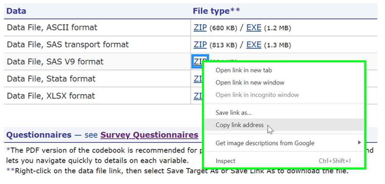

# Analyzing MEPS data using SAS <!-- omit in toc -->

- [Loading MEPS data](#loading-meps-data)
  - [Data years 2017 and later: SAS V9 files](#data-years-2017-and-later-sas-v9-files)
  - [Data years 1996-2016: `PROC XCOPY`](#data-years-1996-2016-proc-xcopy)
- [Automating file download](#automating-file-download)
- [Saving SAS data (.sas7bdat)](#saving-sas-data-sas7bdat)
- [SAS SURVEY procedures](#sas-survey-procedures)
- [SAS examples](#sas-examples)
  - [Workshop exercises](#workshop-exercises)
  - [Summary tables examples](#summary-tables-examples)
  - [Older Exercises (1996 to 2006)](#older-exercises-1996-to-2006)

# Loading MEPS data

For data years 2017 and later (and also for the 2016 Medical Conditions file), .zip files for multiple file formats are available, including ASCII (.dat), SAS V9 (.sas7bdat), Stata (.dta), and Excel (.xlsx). Prior to 2017, ASCII (.dat) and SAS transport (.ssp) files are provided for all datasets.

The recommended file formats are the SAS V9 data files (.sas7bdat) for data years 2017 and later, and the SAS transport (.ssp) format for data years 1996-2016.


## Data years 2017 and later: SAS V9 files

The <b>SAS V9 (.sas7bdat)</b> format is the recommended format for loading MEPS data files from 2017 and later (and also for the 2016 Medical Conditions file). For the following example, the 2018 Dental Visits files (<b>h206b.sas7bdat</b>) has been [downloaded from the MEPS website](https://meps.ahrq.gov/mepsweb/data_stats/download_data_files_detail.jsp?cboPufNumber=HC-206B), unzipped, and saved in the local directory <b>C:/MEPS</b>:

``` sas
DATA work.h206b;
  SET "C:/MEPS/h206b.sas7bdat";
RUN;

/* View first 10 rows of data */
PROC PRINT data = h206b (obs=10);
RUN;
```

## Data years 1996-2016: `PROC XCOPY`

For data years prior to 2017, ASCII and SAS transport (XPORT) file formats were released for the MEPS public use files. The <b>SAS transport (.ssp) </b> format is the recommended file type for loading MEPS data files from 1996-2016 (excluding the 2016 Medical Conditions file).

SAS transport (.ssp) files can be read into SAS using `PROC XCOPY`. In the following examples, the SAS transport file for the 2016 Dental Visits file (h188b.ssp) has been downloaded from the MEPS website, unzipped, and saved in the local directory <b>C:\MEPS</b>
``` sas
FILENAME in_h188b "C:\MEPS\h188b.ssp";
PROC XCOPY in = in_h188b out = WORK IMPORT;
RUN;

/* View first 10 rows of data */
PROC PRINT data = h188b (obs=10);
RUN;
```

# Automating file download

Instead of having to manually download, unzip, and store MEPS data files in a local directory, it may be beneficial to automatically download MEPS data directly from the MEPS website. 

The following code downloads and unzips the 2018 Dental Visits (h206b) directly from the MEPS website and stores it in the "C:/MEPS" folder. This code is adapted from [SAS blogs by Chris Hemedinger](https://blogs.sas.com/content/sasdummy/2015/05/11/using-filename-zip-to-unzip-and-read-data-files-in-sas/) and a macro created by Pradip Muhuri:

``` sas
/* You must assign macro variables: MEPS file name, URL, and local directory where files will be stored*/
%let meps_file = h206b;
%let meps_url = https://meps.ahrq.gov/mepsweb/data_files/pufs/h206b/h206bv9.zip;
%let meps_dir = C:/MEPS/sas_data;


/* DO NOT EDIT this section *******************************/
/* Download zip file from MEPS website to specified directory (meps_dir) */
filename zipfile "&meps_dir/&meps_file.v9.zip";

proc http 
	url = "&meps_url"
	out = zipfile;
run;

/* Unzip SAS dataset and save in specified directory */
filename inzip ZIP "&meps_dir/&meps_file.v9.zip";	
filename sasfile "&meps_dir/&meps_file..sas7bdat" ;
 
data _null_;
	infile inzip(&meps_file..sas7bdat) 
	  lrecl=256 recfm=F length=length eof=eof unbuf;
   file sasfile lrecl=256 recfm=N;
   input;
   put _infile_ $varying256. length;
   return;
 eof:
   stop;
run;
/* End of DO NOT EDIT section ***************************/

/* Read in the saved SAS V9 dataset */
data dn2018;
	set "&meps_dir/&meps_file..sas7bdat";
run;

/* View first 5 rows of dataset */
proc print data = dn2018 (obs = 5);
run;
```

To download additional files programmatically, replace 'h206b' in the above code with the desired filename (see [meps_files_names.csv](https://github.com/HHS-AHRQ/MEPS/blob/master/Quick_Reference_Guides/meps_file_names.csv) for a list of MEPS file names by data type and year). The full URL for the `url` macro variable can be found by right-clicking the 'ZIP' hyperlink on the web page for the data file, selecting 'Copy link address', then pasting into a text editor or code editor.




# Saving SAS data (.sas7bdat)

Once the MEPS data has been loaded into SAS, it can be saved as a permanent SAS dataset (.sas7bdat). In the following code, the h206b dataset is saved in the 'SAS\data' folder (first create the 'MEPS\SAS\data' folder if needed):
``` sas
LIBNAME sasdata 'C:\MEPS\SAS\data';

data sasdata.dn2018;
  set WORK.h206b;
run;
```

# SAS SURVEY procedures
To analyze MEPS data using SAS, the following steps are recommended to ensure unbiased estimates and proper standard errors (from [SAS Global Forum Paper 4113-2020 by David R. Nelson and Siew Wong-Jacobson](https://www.sas.com/content/dam/SAS/support/en/sas-global-forum-proceedings/2020/4113-2020.pdf)):
1. Always use the SAS [SURVEY procedures](https://support.sas.com/rnd/app/stat/procedures/SurveyAnalysis.html) (e.g. SURVEYMEANS, SURVEYREG)
2. Always use the cluster (e.g. VARPSU), strata (e.g. VARSTR), and appropriate weights (e.g. PERWT18F)
3. Do not delete observations or use BY or WHERE statements. Instead, create an analytical
subset for use as a DOMAIN; analyzing the subgroup alone may affect the standard errors.

As an example, the following code will estimate the total healthcare expenditures in 2018:
``` sas
proc surveymeans data = h206b sum;
  stratum VARSTR;
  cluster VARPSU;
  weight PERWT18F;
  var DVXP18X;
run;
```


# SAS examples

In order to run the example codes, you must download the relevant MEPS files from the MEPS website and save them to your local computer.

## Workshop exercises
Example codes from previous MEPS workshops are provided in the [workshop_exercises](workshop_exercises) folder. Each exercise contains three files: SAS code (e.g. Exercise1.sas), a SAS log file (e.g. Exercise1_log.TXT) and a SAS output file (e.g. Exercise1_OUTPUT.TXT):

### 1. National health care expenses <!-- omit in toc -->
[exercise_1a](workshop_exercises/exercise_1a): National health care expenses by age group, 2016
<br>
[exercise_1b](workshop_exercises/exercise_1b): National health care expenses by age group and type of service, 2015
<br>
[exercise_1c](workshop_exercises/exercise_1c): National health care expenses by age group, 2018
<br>

### 2. Prescribed medicine purchases <!-- omit in toc -->
[exercise_2a](workshop_exercises/exercise_2a): Trends in antipsychotics purchases and expenses, 2015
<br>
[exercise_2b](workshop_exercises/exercise_2b): Purchases and expenses for narcotic analgesics or narcotic analgesic combos, 2016
<br>
[exercise_2c](workshop_exercises/exercise_2c): Purchases and expenses for narcotic analgesics or narcotic analgesic combos, 2018


### 3. Medical conditions <!-- omit in toc -->
[exercise_3a](workshop_exercises/exercise_3a): Use and expenditures for persons with diabetes, 2015
<br>
[exercise_3b](workshop_exercises/exercise_3b): Expenditures for all events associated with diabetes, 2015

### 4. Pooling data files <!-- omit in toc -->
[exercise_4a](workshop_exercises/exercise_4a): Pooling MEPS FYC files, 2015 and 2016: Out-of-pocket expenditures for unisured persons ages 26-30 with high income
<br>
[exercise_4b](workshop_exercises/exercise_4b): Pooling longitudinal files, panels 17-19
<br>
[exercise_4c](workshop_exercises/exercise_4c): Pooling MEPS FYC files, 2017 and 2018: People with joint pain, using JTPAIN31 for 2017 and JTPAIN31_M18 for 2018
<br>
[exercise_4d](workshop_exercises/exercise_4d): Pooling MEPS FYC files, 2017-2019: People with joint pain, using [Pooled Linkage Variance file](https://meps.ahrq.gov/mepsweb/data_stats/download_data_files_detail.jsp?cboPufNumber=HC-036) for correct standard error calculation (required when pooling before and after 2019)
<br>

### 5. Constructing variables <!-- omit in toc -->
[exercise_5a](workshop_exercises/exercise_5a): Constructing family-level variables from person-level data, 2015
<br>
[exercise_5b](workshop_exercises/exercise_5b): Constructing insurance status from monthly insurance variables, 2015

### 6. Regression <!-- omit in toc -->
[exercise_6a](workshop_exercises/exercise_6a): Logistic regression to identify demographic factors associated with receiving a flu shot in 2018 (using SAQ population)
<br>
[exercise_6b](workshop_exercises/exercise_6b): Logistic regression for persons that delayed medical care because of COVID, 2020
<br>

## Summary tables examples

The following codes provided in the [summary_tables_examples](summary_tables_examples) folder re-create selected statistics from the [MEPS-HC Data Tools](https://datatools.ahrq.gov/meps-hc). These example codes are written under the assumption that the .ssp files are saved in the local directory "C:/MEPS/". However, you can customize the programs to point to an alternate directory.


### Accessibility and Quality of Care  <!-- omit in toc -->

#### Access to Care <!-- omit in toc -->
[care_access_2017.sas](summary_tables_examples/care_access_2017.sas):
Reasons for difficulty receiving needed care, by poverty status, 2017
<br>
[care_access_2019.sas](summary_tables_examples/care_access_2019.sas):
Number and percent of people who did not receive treatment because they couldn't afford it, by poverty status, 2019

#### Diabetes Care <!-- omit in toc -->
[care_diabetes_a1c_2016.sas](summary_tables_examples/care_diabetes_a1c_2016.sas): Adults with diabetes receiving hemoglobin A1c blood test, by race/ethnicity, 2016

#### Quality of Care <!-- omit in toc -->
[care_quality_2016.sas](summary_tables_examples/care_quality_2016.sas): Ability to schedule a routine appointment, by insurance coverage, 2016


### Medical conditions <!-- omit in toc -->
[cond_expenditures_2015.sas](summary_tables_examples/cond_expenditures_2015.sas): Utilization and expenditures by medical condition, 2015 -- Conditions defined by collapsed ICD-9/CCS codes
<br>
[cond_expenditures_2018.sas](summary_tables_examples/cond_expenditures_2018.sas): Utilization and expenditures by medical condition, 2018 -- Conditions defined by collapsed ICD-10/CCSR codes


### Health Insurance <!-- omit in toc -->
[ins_age_2016.sas](summary_tables_examples/ins_age_2016.sas): Health insurance coverage by age group, 2016


### Prescribed drugs <!-- omit in toc -->
[pmed_prescribed_drug_2016.sas](summary_tables_examples/pmed_prescribed_drug_2016.sas): Purchases and expenditures by generic drug name, 2016
<br>
[pmed_therapeutic_class_2016.sas](summary_tables_examples/pmed_therapeutic_class_2016.sas): Purchases and expenditures by Multum therapeutic class, 2016


### Use, expenditures, and population <!-- omit in toc -->
[use_events_2016.sas](summary_tables_examples/use_events_2016.sas): Number of events and mean expenditure per event, for office-based and outpatient events, by source of payment, 2016
<br>
[use_expenditures_2016.sas](summary_tables_examples/use_expenditures_2016.sas): Expenditures for office-based and outpatient visits, by source of payment, 2016
<br>
[use_expenditures_2019.sas](summary_tables_examples/use_expenditures_2019.sas): Mean expenditure per person, by event type and source of payment, 2019.
<br>
[use_race_sex_2016.sas](summary_tables_examples/use_race_sex_2016.sas): Utilization and expenditures by race and sex, 2016


## Older Exercises (1996 to 2006)

Codes provided in the [older_exercises_1996_to_2006](older_exercises_1996_to_2006) folder include older SAS programs for analyzing earlier years of MEPS data. Each folder includes a SAS program (.sas) and SAS output (.pdf)

### Estimation examples <!-- omit in toc -->

[E1](older_exercises_1996_to_2006/Estimation_examples/E1):
Person-level estimates (means, proportions, and totals) for healthcare expenditures, 2001
<br>
[E2](older_exercises_1996_to_2006/Estimation_examples/E2): Average total healthcare expenditures for children ages 0-5, 1996-1999
<br>
[E3](older_exercises_1996_to_2006/Estimation_examples/E3): Longitudinal estimates of insurance coverage and expenditures, 1999-2000
<br>
[E4](older_exercises_1996_to_2006/Estimation_examples/E4): Family-level estimates for healthcare expenditures, 2001
<br>
[E5](older_exercises_1996_to_2006/Estimation_examples/E5): Event-level expenditure estimates for  hospital inpatient stays and office-based medical provider visits, 2001
<br>
[E6](older_exercises_1996_to_2006/Estimation_examples/E6): National health care expenditures by type of service, 2005 (Statistical Brief #193)
<br>
[E7](older_exercises_1996_to_2006/Estimation_examples/E7): Colonoscopy screening estimates, 2005 (Statistical Brief #188)
<br>
[E8](older_exercises_1996_to_2006/Estimation_examples/E8): Expenditures for inpatient stays by source of payment, per stay, per diem, with and without surgery, 2005

### Employment examples <!-- omit in toc -->
[EM1](older_exercises_1996_to_2006/Employment_examples/EM1): Relationship between health status and current main job weekly earnings, 2002
<br>
[EM2](older_exercises_1996_to_2006/Employment_examples/EM2): Determine how many people working at the beginning of the year changed jobs, 2002

### Linking examples <!-- omit in toc -->
[L1](older_exercises_1996_to_2006/Linking_examples/L1): Merge the 2001 MEPS full-year file and the 2001 MEPS Jobs file
<br>
[L1A](older_exercises_1996_to_2006/Linking_examples/L1A): Combine the 2000 and 2001 MEPS Jobs files
<br>
[L2](older_exercises_1996_to_2006/Linking_examples/L2): Link 2001 MEPS data with 1999 and 2000 NHIS data
<br>
[L3](older_exercises_1996_to_2006/Linking_examples/L3): Merge 2001 MEPS Office-based Medical Provider Visits file with full-year file
<br>
[L4](older_exercises_1996_to_2006/Linking_examples/L4): Merge 2001 MEPS Medical Conditions file with full-year file
<br>
[L5](older_exercises_1996_to_2006/Linking_examples/L5): Merge 2001 MEPS Medical Conditions file with full-year file and various event files

### Miscellaneous examples <!-- omit in toc -->
[M1](older_exercises_1996_to_2006/Misc_examples/M1): Demonstrates need for weight variables when analyzing MEPS data, 2005
<br>
[M2](older_exercises_1996_to_2006/Misc_examples/M2): Demonstrates need for using the STRATUM and PSU variables when analyzing MEPS data, 2005
<br>
[M3](older_exercises_1996_to_2006/Misc_examples/M3): Using ID variables to merge MEPS files, 2005
<br>
[M4](older_exercises_1996_to_2006/Misc_examples/M4): Illustrates two ways to calculate the number of events associated with conditions. (1) using the evNUM variables on the CONDITIONS file. (2) using the number of matches between the CONDITIONS file and the CLINK file, 2003
<br>
[M5](older_exercises_1996_to_2006/Misc_examples/M5): Demonstrates the difference between two uses of the term "priority condition" in MEPS, 2005
<br>
[M6](older_exercises_1996_to_2006/Misc_examples/M6): Demonstrates use of the Diabetes Care Supplement (DCS) weight variable, 2006
<br>
[M7](older_exercises_1996_to_2006/Misc_examples/M7): Person-level prescribed medicine expenditures for persons with at least one PMED event, 2003
<br>
[M8](older_exercises_1996_to_2006/Misc_examples/M8): Prescribed medicine expenditures associated with cancer conditions, 2005
<br>
[M9](older_exercises_1996_to_2006/Misc_examples/M9): Descriptive statistics of health insurance status and healthcare utilization, 2005
<br>
[M10](older_exercises_1996_to_2006/Misc_examples/M10): Compares hospital inpatient expenditures (facility, physician, total) for stays that do and do not include facility expenditures for the preceding emergency room visit, 2003
<br>
[M11](older_exercises_1996_to_2006/Misc_examples/M11): Merge parents' employment status variable  to children's records, 2006
