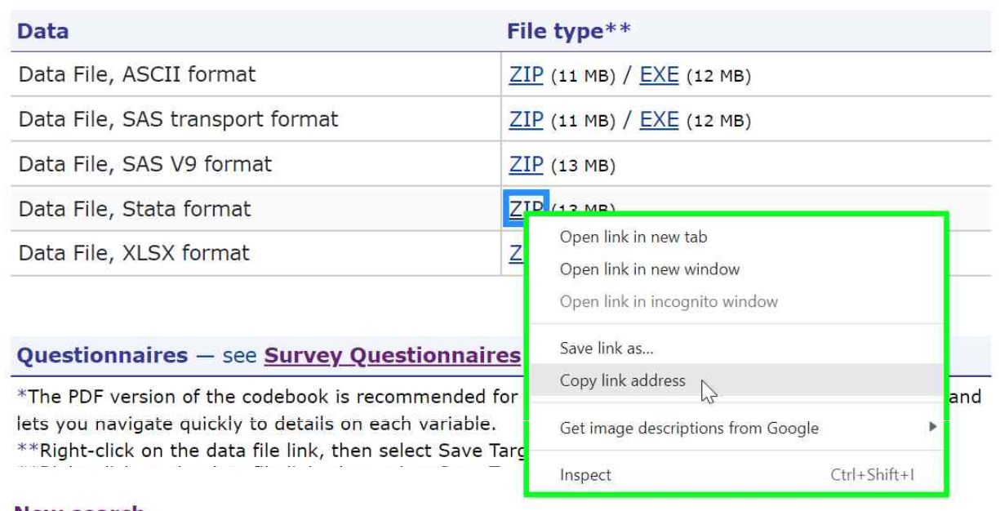

# Analyzing MEPS data using Stata  <!-- omit in toc -->

- [Loading MEPS data](#loading-meps-data)
  - [Data years 2017 and later: Stata (.dta) files](#data-years-2017-and-later-stata-dta-files)
  - [Data years 1996-2016: SAS XPORT format](#data-years-1996-2016-sas-xport-format)
- [Automating file download](#automating-file-download)
- [Saving Stata data (.dta)](#saving-stata-data-dta)
- [Stata `svy` commands](#stata-svy-commands)
- [Stata examples](#stata-examples)
  - [Workshop exercises](#workshop-exercises)
  - [Summary tables examples](#summary-tables-examples)

# Loading MEPS data

For data years 2017 and later (and also for the 2016 Medical Conditions file), .zip files for multiple file formats are available, including ASCII (.dat), SAS V9 (.sas7bdat), Stata (.dta), and Excel (.xlsx). Prior to 2017, ASCII (.dat) and SAS transport (.ssp) files are provided for all datasets.

The recommended file formats are the Stata data files (.dta) for data years 2017 and later (and also for the 2016 Medical Conditions file), and the SAS transport (.ssp) format for data years 1996-2016 (excluding the 2016 Medical Conditions file).

Note that the case of variable names may differ depending on which type of data file is used. Loading SAS transport (.ssp) files typically results in all lowercase variable names, while the Stata (.dta) files generally have uppercase variable names. Users may wish to use the `rename *, lower` command to convert all variables to lowercase for consistency.


## Data years 2017 and later: Stata (.dta) files

The <b>Stata data (.dta)</b> format is the recommended file format for loading MEPS data files from 2017 and later (and also for the 2016 Medical Conditions file). 

> <b> IMPORTANT! </b> SAS transport (.ssp) versions of most these files were created using the SAS CPORT engine. These CPORT data files cannot be read directly into R, and alternative file formats must be used instead.

For the following example, the 2018 Dental Visits files (<b>h206b.dta</b>) has been [downloaded from the MEPS website](https://meps.ahrq.gov/mepsweb/data_stats/download_data_files_detail.jsp?cboPufNumber=HC-206B), unzipped, and saved in the local directory <b>C:/MEPS</b>:

``` stata
set more off
use "C:/MEPS/h206b.dta", clear

/* View dataset */
browse

/* Optional: convert all variable names to lower-case */
rename *, lower
```

## Data years 1996-2016: SAS XPORT format

For data years prior to 2017, ASCII and SAS transport (XPORT) file formats were released for the MEPS public use files. The <b>SAS transport (.ssp)</b> format is the recommended file type for loading MEPS data files from 1996-2016 (excluding the 2016 Medical Conditions file).

These files can be loaded using the `import` command. In the following example, the transport file for the 2016 Dental Visits file (<b>h188b.ssp</b>) has been downloaded from the MEPS website, unzipped, and saved in the local directory <b>C:/MEPS</b>.

``` stata
/* Note: for Stata version 15 or earlier, use sasxport instead of sasxport5 */

set more off
import sasxport5 "C:/MEPS/h188b.ssp", clear

/* View dataset */
browse
```

# Automating file download

Instead of having to manually download, unzip, and store MEPS data files in a local directory, it may be beneficial to automatically download MEPS data directly from the MEPS website. This can be accomplished using the `copy` and `unzipfile` commands.

The following code downloads and unzips the 2018 Dental Visits (h206b) directly from the MEPS website and stores it in the "C:/MEPS" folder. The `use` command is then used to read the .dta file into Stata:

``` stata
/* 2018 Dental Visits */
cd "C:/MEPS"

copy "https://meps.ahrq.gov/mepsweb/data_files/pufs/h206b/h206bdta.zip" ///
"C:/MEPS/h206bdta.zip"

unzipfile "C:/MEPS/h206bdta.zip"
use "C:/MEPS/h206b.dta", clear

/* View dataset */
browse
```

To download additional files programmatically, replace 'h206b' in the above code with the desired filename (see [meps_files_names.csv](https://github.com/HHS-AHRQ/MEPS/blob/master/Quick_Reference_Guides/meps_file_names.csv) for a list of MEPS file names by data type and year). The full URL of each zip file can be found by right-clicking the 'ZIP' hyperlink on the web page for the data file, selecting 'Copy link address', then pasting into a text editor or code editor.



# Saving Stata data (.dta)

Once the MEPS data has been loaded into Stata, it can be saved as a permanent Stata dataset (.dta). In the following code,  the 2018 Dental Visits dataset is saved to the C:/ drive (first create the 'MEPS\Stata\data' folder if needed):
``` Stata
save "C:\MEPS\Stata\data\dn2018.dta"
clear
```

# Stata `svy` commands
To analyze MEPS data using Stata, [`svy` commands](http://www.stata.com/manuals13/svysvyestimation.pdf) should be used to ensure unbiased estimates. As an example, the following code will estimate the total dental expenditures in 2018:

``` stata
use DUPERSID PERWT18F VARPSU VARSTR DVXP18X using "C:\MEPS\h206b.dta", clear

svyset VARPSU [pweight=PERWT18F], str(VARSTR)

svy: total DVXP18X
```


# Stata examples

In order to run the example codes, you must download the relevant MEPS files from the MEPS website and save them to your local computer.

## Workshop exercises
The following example codes from previous MEPS workshops are provided in the [workshop_exercises](workshop_exercises) folder:

### 1. National health care expenses  <!-- omit in toc -->
[Exercise1a.do](workshop_exercises/Exercise1a.do): National health care expenses by age group, 2016
<br>
[Exercise1b.do](workshop_exercises/Exercise1b.do): National health care expenses by age group and type of service, 2015
<br>
[Exercise1c.do](workshop_exercises/Exercise1c.do): National health care expenses by age group, 2018
<br>

### 2. Prescribed medicine purchases <!-- omit in toc -->
[Exercise2a.do](workshop_exercises/Exercise2a.do): Trends in antipsychotics purchases and expenses, 2015
<br>
[Exercise2b.do](workshop_exercises/Exercise2b.do): Purchases and expenses for narcotic analgesics or narcotic analgesic combos, 2016
<br>
[Exercise2c.do](workshop_exercises/Exercise2c.do): Purchases and expenses for narcotic analgesics or narcotic analgesic combos, 2018

### 3. Medical conditions <!-- omit in toc -->
[Exercise3a.do](workshop_exercises/Exercise3a.do): Use and expenditures for persons with diabetes, 2015
<br>
[Exercise3b.do](workshop_exercises/Exercise3b.do): Expenditures for all events associated with diabetes, 2015
<br>

### 4. Pooling data files <!-- omit in toc -->
[Exercise4a.do](workshop_exercises/Exercise4a.do): Pooling MEPS FYC files, 2015 and 2016
<br>
[Exercise4b.do](workshop_exercises/Exercise4b.do): Pooling longitudinal files, panels 17-19
<br>
[Exercise4c.do](workshop_exercises/Exercise4c.do): Pooling MEPS FYC files, 2017 and 2018: People with joint pain, using JTPAIN31 for 2017 and JTPAIN31_M18 for 2018
<br>
[Exercise4d.do](workshop_exercises/Exercise4d.do): Pooling MEPS FYC files, 2017-2019: People with joint pain, using [Pooled Linkage Variance file](https://meps.ahrq.gov/mepsweb/data_stats/download_data_files_detail.jsp?cboPufNumber=HC-036) for correct standard error calculation (required when pooling before and after 2019)
<br>
### 5. Constructing variables <!-- omit in toc -->
[Exercise5a.do](workshop_exercises/Exercise5a.do): Constructing family-level variables from person-level data, 2015
<br>
[Exercise5b.do](workshop_exercises/Exercise5b.do): Constructing insurance status from monthly insurance variables, 2015

### 6. Regression <!-- omit in toc -->
[Exercise6a.do](workshop_exercises/Exercise6a.do): Logistic regression to identify demographic factors associated with receiving a flu shot in 2018 (using SAQ population)
<br>
[Exercise6b.do](workshop_exercises/Exercise6b.do): Logistic regression for persons that delayed medical care because of COVID, 2020
<br>

## Summary tables examples

The following codes provided in the [summary_tables_examples](summary_tables_examples) folder re-create selected statistics from the [MEPS-HC Data Tools](https://datatools.ahrq.gov/meps-hc). 


### Accessibility and Quality of Care  <!-- omit in toc -->

#### Access to Care <!-- omit in toc -->
[care_access_2017.do](summary_tables_examples/care_access_2017.do):
Reasons for difficulty receiving needed care, by poverty status, 2017
<br>
[care_access_2019.do](summary_tables_examples/care_access_2019.do):
Number and percent of people who did not receive treatment because they couldn't afford it, by poverty status, 2019

#### Diabetes Care <!-- omit in toc -->
[care_diabetes_a1c_2016.do](summary_tables_examples/care_diabetes_a1c_2016.do): Adults with diabetes receiving hemoglobin A1c blood test, by race/ethnicity, 2016

#### Quality of Care <!-- omit in toc -->
[care_quality_2016.do](summary_tables_examples/care_quality_2016.do): Ability to schedule a routine appointment, by insurance coverage, 2016


### Medical conditions <!-- omit in toc -->
[cond_expenditures_2015.do](summary_tables_examples/cond_expenditures_2015.do): Utilization and expenditures by medical condition, 2015 -- Conditions defined by collapsed ICD-9/CCS codes


### Health Insurance <!-- omit in toc -->
[ins_age_2016.do](summary_tables_examples/ins_age_2016.do): Health insurance coverage by age group, 2016


### Prescribed drugs <!-- omit in toc -->
[pmed_prescribed_drug_2016.do](summary_tables_examples/pmed_prescribed_drug_2016.do): Purchases and expenditures by generic drug name, 2016
<br>
[pmed_therapeutic_class_2016.do](summary_tables_examples/pmed_therapeutic_class_2016.do): Purchases and expenditures by Multum therapeutic class, 2016


### Use, expenditures, and population <!-- omit in toc -->
[use_events_2016.do](summary_tables_examples/use_events_2016.do): Number of events and mean expenditure per event, for office-based and outpatient events, by source of payment, 2016
<br>
[use_expenditures_2016.do](summary_tables_examples/use_expenditures_2016.do): Expenditures for office-based and outpatient visits, by source of payment, 2016
<br>
[use_expenditures_2019.do](summary_tables_examples/use_expenditures_2019.do): Mean expenditure per person, by event type and source of payment, 2019.
<br>
[use_race_sex_2016.do](summary_tables_examples/use_race_sex_2016.do): Utilization and expenditures by race and sex, 2016
