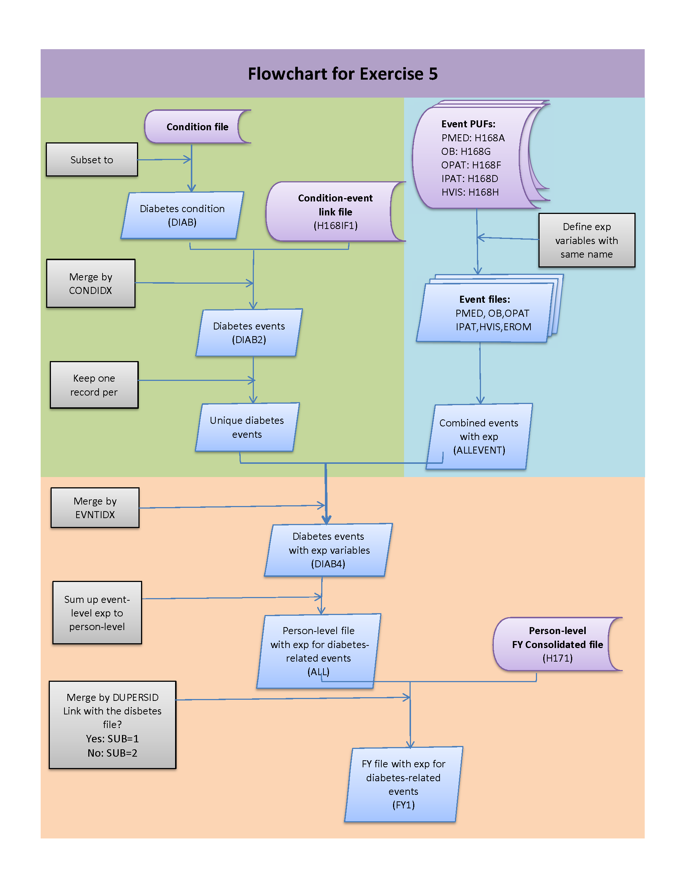

# Stata Exercise 5

## Loading the data
Use the following links to download the data .zip files, then unzip and save to a local directory (e.g. 'C:\MEPS\data'):

**Input Files**:  
[H171 (2014 Full year consolidated PUF data)](https://meps.ahrq.gov/mepsweb/data_files/pufs/h171ssp.zip)
<br>[H170 (2014 Condition PUF data)](https://meps.ahrq.gov/mepsweb/data_files/pufs/h170ssp.zip)
<br>[H168A (2014 PMED PUF data)](https://meps.ahrq.gov/mepsweb/data_files/pufs/h168assp.zip)
<br>[H168D (2014 Inpatient visits PUF data)](https://meps.ahrq.gov/mepsweb/data_files/pufs/h168dssp.zip)
<br>[H168E (2014 ER visits PUF data)](https://meps.ahrq.gov/mepsweb/data_files/pufs/h168essp.zip)
<br>[H168F (2014 Outpatient visits PUF data)](https://meps.ahrq.gov/mepsweb/data_files/pufs/h168fssp.zip)
<br>[H168G (2014 Office-based visits PUF data)](https://meps.ahrq.gov/mepsweb/data_files/pufs/h168gssp.zip)
<br>[H168H (2014 Home Health PUF data)](https://meps.ahrq.gov/mepsweb/data_files/pufs/h168hssp.zip)
<br>[H168IF1 (2014 Condition-event link PUF data)](https://meps.ahrq.gov/mepsweb/data_files/pufs/h168if1ssp.zip)

Next, run the following code to convert the transport files (.ssp) to Stata datasets (.dta) and save to a local directory (first create the target folder 'C:\MEPS\Stata\data' if needed):
``` stata
clear
import sasxport "C:\MEPS\data\h171.ssp"
save "C:\MEPS\Stata\data\h171.dta", replace
clear

import sasxport "C:\MEPS\data\h170.ssp"
save "C:\MEPS\Stata\data\h170.dta", replace
clear

import sasxport "C:\MEPS\data\h168a.ssp"
save "C:\MEPS\Stata\data\h168a.dta", replace
clear

import sasxport "C:\MEPS\data\h168d.ssp"
save "C:\MEPS\Stata\data\h168d.dta", replace
clear

import sasxport "C:\MEPS\data\h168e.ssp"
save "C:\MEPS\Stata\data\h168e.dta", replace
clear

import sasxport "C:\MEPS\data\h168f.ssp"
save "C:\MEPS\Stata\data\h168f.dta", replace
clear

import sasxport "C:\MEPS\data\h168g.ssp"
save "C:\MEPS\Stata\data\h168g.dta", replace
clear

import sasxport "C:\MEPS\data\h168h.ssp"
save "C:\MEPS\Stata\data\h168h.dta", replace
clear

import sasxport "C:\MEPS\data\h168if1.ssp"
save "C:\MEPS\Stata\data\h168if1.dta", replace
clear
```

## Summary
This exercise illustrates how to calculate expenditures for all events associated with a condition. The condition used in this exercise is diabetes (049 or 050 in definitions table below).

The following flow chart illustrates the steps needed to create the analytical dataset:



Definition of 61 conditions based on the CCS code:

No. | Condition | CCS Codes
-------|------------- |-------------
1|Infectious diseases |1-9
2|  Cancer   | 11-45
3|  Non-malignant neoplasm  |46, 47
4|  Thyroid disease  |48
5|  Diabetes mellitus| 49,50
6|  Other endocrine, nutritional & immune disorder  |51, 52, 54 - 58
7|  Hyperlipidemia   |53
9|  Hemorrhagic, coagulation, and disorders of White Blood cells | 60-64
8|  Anemia and other deficiencies  |59
10| Mental disorders |650-670
11| CNS infection  |76-78
12| Hereditary, degenerative and other nervous system disorders  |79-81
13| Paralysis |82
14| Headache |84
15| Epilepsy and convulsions   |83
16| Coma, brain damage |85
17| Cataract|86
18| Glaucoma | 88
19| Other eye disorders  | 87, 89-91
20| Otitis media | 92
21| Other CNS disorders  | 93-95
22| Hypertension | 98,99
23| Heart disease| 96, 97, 100-108
24| Cerebrovascular disease| 109-113
25| Other circulatory conditions arteries, veins, and lymphatics| 114 -121
26| Pneumonia| 122
27| Influenza| 123
28| Tonsillitis  | 124
29| Acute Bronchitis and URI   | 125 , 126
30| COPD, asthma | 127-134
31| Intestinal infection | 135
32| Disorders of teeth and jaws| 136
33| Disorders of mouth and esophagus   | 137
34| Disorders of the upper GI  | 138-141
35| Appendicitis | 142
36| Hernias| 143
37| Other stomach and intestinal disorders   | 144- 148
38| Other GI | 153-155
39| Gallbladder, pancreatic, and liver disease   | 149-152
40| Kidney Disease   | 156-158, 160, 161
41| Urinary tract infections   | 159
42| Other urinary| 162,163
43| Male genital disorders | 164-166
44| Non-malignant breast disease   | 167
46| Complications of pregnancy and birth | 177-195
45| Female genital disorders, and contraception  | 168-176
47| Normal birth/live born | 196, 218
48| Skin disorders   | 197-200
49| Osteoarthritis and other non-traumatic joint disorders |201-204
50| Back problems| 205
51| Other bone and musculoskeletal  disease  | 206-209, 212
52| Systemic lupus and connective tissues disorders  | 210-211
53| Congenital anomalies | 213-217
54| Perinatal Conditions | 219-224
55| Trauma-related disorders   | 225-236, 239, 240, 244
56| Complications of surgery or device | 237, 238
57| Poisoning by medical and non-medical substances  | 241 - 243
58| Residual Codes   | 259
59| Other care and screening   | 10, 254-258
60| Symptoms | 245-252
61| Allergic reactions   | 253
